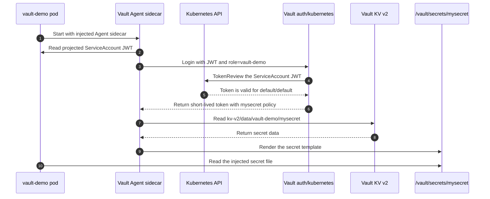

# Vault Agent Sidecar Secret Demo

This scenario demonstrates the baseline Vault Agent Injector pattern in a
single Kubernetes cluster. A pod authenticates to Vault with its Kubernetes
ServiceAccount identity, Vault Agent renders a KV secret into a shared file,
and the application reads that file without storing a static Vault token.

This scenario is independent of the [OpenTelemetry metrics demo](./otel-metrics-demo.md)
and the [two-cluster VSO demo](./vso-jwt-oidc-demo.md).

## What this scenario proves

- The application pod and Vault run in `kind-vault-lab`.
- The pod authenticates through Vault's `auth/kubernetes` mount.
- Vault validates the pod's ServiceAccount JWT through Kubernetes TokenReview.
- The `vault-demo` role is restricted to the `default/default` ServiceAccount.
- The issued token carries the least-privilege `mysecret` policy.
- Vault Agent renders `kv-v2/vault-demo/mysecret` to
  `/vault/secrets/mysecret`.
- The application has no hard-coded Vault token or secret value.

## Architecture



Both containers share the `/vault/secrets/` volume. For the sidecar delivery
path, Vault Agent owns the authentication and rendering lifecycle and the
application reads the file. The current demo container also performs a separate
manual Kubernetes-auth login for diagnostic comparison; that code is not
required to consume the Agent-rendered file.

## Resources

| Resource | Purpose |
| --- | --- |
| `default/vault-0` | Vault server and Kubernetes auth endpoint. |
| `auth/kubernetes` | Validates ServiceAccount JWTs through TokenReview. |
| `kv-v2/vault-demo/mysecret` | Source KV v2 secret. |
| `mysecret` policy | Grants read access only to the source secret. |
| `vault-demo` role | Maps `default/default` to the `mysecret` policy. |
| `default/vault-demo` | Application pod with the injected Vault Agent sidecar. |

## Prepare the scenario

### Prerequisites

- Podman Desktop and the Podman CLI
- `kind`
- `kubectl`
- `helm`
- `KIND_EXPERIMENTAL_PROVIDER=podman`

From the repository root:

```sh
export KIND_EXPERIMENTAL_PROVIDER=podman

helm repo add hashicorp https://helm.releases.hashicorp.com
helm repo update

make clusters
make setup-vault
```

`make clusters` creates both repository clusters, but this scenario uses only
`kind-vault-lab`. `make setup-vault` installs Vault, configures Kubernetes
auth, writes the baseline secret, and creates the sidecar pod.

## Important configuration

### Vault policy

```hcl
path "kv-v2/data/vault-demo/mysecret" {
  capabilities = ["read"]
}
```

### Kubernetes auth role

```sh
vault write auth/kubernetes/role/vault-demo \
  alias_name_source=serviceaccount_name \
  bound_service_account_names=default \
  bound_service_account_namespaces=default \
  policies=default,mysecret \
  ttl=1h
```

### Injector annotations

```yaml
vault.hashicorp.com/agent-inject: "true"
vault.hashicorp.com/role: "vault-demo"
vault.hashicorp.com/agent-inject-secret-mysecret: "kv-v2/data/vault-demo/mysecret"
vault.hashicorp.com/agent-inject-template-mysecret: |
  {{- with secret "kv-v2/data/vault-demo/mysecret" -}}
  {{- range $k, $v := .Data.data }}
  {{ $k }}: {{ $v }}
  {{- end }}
  {{ end }}
```

The mutating webhook processes these annotations when the pod is created and
adds the Vault Agent containers and shared volume.

## Run the walkthrough

### 1. Confirm the pod shape

```sh
kubectl --context kind-vault-lab get pod vault-demo -n default
```

Expected state:

```text
NAME         READY   STATUS
vault-demo   2/2     Running
```

`2/2` represents the application container and Vault Agent sidecar.

### 2. Inspect the injected file

```sh
kubectl --context kind-vault-lab exec vault-demo -n default \
  -c vault-demo -- cat /vault/secrets/mysecret
```

Expected content:

```text
username: larry
```

Do not expose the pod's diagnostic login output during a real-environment
demonstration because the current demo container prints its manually obtained
Vault token. This repository uses disposable local clusters, but Vault tokens
must still be treated as credentials.

### 3. Inspect the least-privilege policy

```sh
kubectl --context kind-vault-lab exec vault-0 -n default -- \
  vault policy read mysecret
```

### 4. Inspect the identity binding

```sh
kubectl --context kind-vault-lab exec vault-0 -n default -- \
  vault read auth/kubernetes/role/vault-demo
```

Point out:

```text
bound_service_account_names         [default]
bound_service_account_namespaces    [default]
token_policies                      [default mysecret]
```

## How the pieces work together

1. The `vault-demo` pod starts as the `default/default` ServiceAccount.
2. Kubernetes projects a signed ServiceAccount JWT into the pod.
3. Vault Agent sends that JWT and the `vault-demo` role name to
   `auth/kubernetes/login`.
4. Vault calls the Kubernetes TokenReview API and checks the role's bound
   ServiceAccount name and namespace.
5. Vault returns a short-lived token carrying the `mysecret` policy.
6. Vault Agent reads the KV v2 secret and renders the configured template to
   `/vault/secrets/mysecret`.
7. The application reads the local file. This sidecar path requires no
  application-side Vault login or hard-coded Vault credential; the pod's
  additional manual login exists only as a diagnostic comparison.

## Troubleshooting

### Pod is not `2/2 Running`

```sh
kubectl --context kind-vault-lab describe pod vault-demo -n default
kubectl --context kind-vault-lab logs vault-demo -n default -c vault-agent-init
kubectl --context kind-vault-lab logs vault-demo -n default -c vault-agent
```

Confirm that the Vault Agent Injector deployment is ready and that the pod was
created after the injector became available. The webhook only mutates pods at
creation time.

### The secret file is missing

Check the annotations, role, and policy:

```sh
kubectl --context kind-vault-lab get pod vault-demo -n default -o yaml
kubectl --context kind-vault-lab exec vault-0 -n default -- \
  vault read auth/kubernetes/role/vault-demo
kubectl --context kind-vault-lab exec vault-0 -n default -- \
  vault policy read mysecret
```

The role must bind `default/default`, and the policy must grant `read` on
`kv-v2/data/vault-demo/mysecret`.

### Vault is sealed

Re-run the idempotent Vault setup:

```sh
make setup-vault
```

The setup script uses the gitignored `vault-init-keys.json` file to unseal an
already-initialised disposable Vault instance. If that file is missing, the
unseal keys are unrecoverable and the local demo cluster must be recreated.
Never commit that file: it contains the demo root token and unseal keys.

## Related scenarios

- [OpenTelemetry authenticated metrics](./otel-metrics-demo.md)
- [Vault Secrets Operator with cross-cluster JWT/OIDC](./vso-jwt-oidc-demo.md)
- [Repository overview](../README.md)
