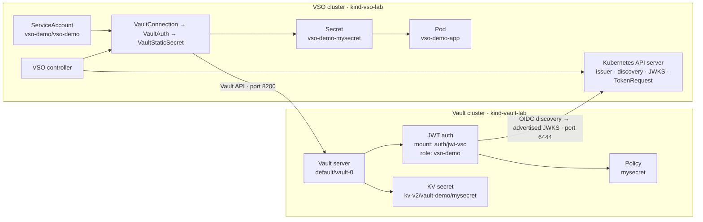
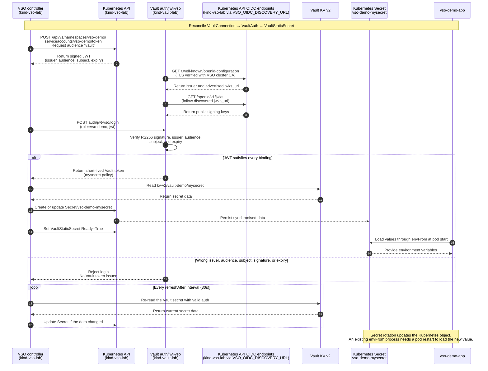

# Vault Secrets Operator Two-Cluster JWT/OIDC Demo

This scenario demonstrates Vault Secrets Operator (VSO) synchronising a Vault
KV secret into a native Kubernetes `Secret` across two separate
Podman-backed kind clusters:

- `kind-vault-lab` (`VAULT_CONTEXT`) runs Vault only.
- `kind-vso-lab` (`VSO_CONTEXT`) runs VSO, its CRDs, and `vso-demo-app` only.

VSO authenticates through Vault's dedicated `auth/jwt-vso` JWT/OIDC mount.
Vault retrieves the VSO cluster's TLS-verified OIDC discovery document, follows
its advertised `jwks_uri`, and verifies ServiceAccount JWTs against those public
keys while binding issuer, audience, and subject. The default path uses no
TokenReview callback and stores no
`token_reviewer_jwt` in Vault.

This scenario is independent of the [Vault Agent sidecar demo](./sidecar-secret-demo.md)
and the [OpenTelemetry metrics demo](./otel-metrics-demo.md).

## Cluster contexts and addresses

This guide uses context variables to ensure every Kubernetes command targets
the intended cluster rather than whichever context happens to be current in
the user's kubeconfig.

| Variable | Default | Meaning |
| --- | --- | --- |
| `VAULT_CONTEXT` | `kind-vault-lab` | The kubeconfig context selecting the Kubernetes cluster where Vault runs. |
| `VSO_CONTEXT` | `kind-vso-lab` | The kubeconfig context selecting the Kubernetes cluster where VSO and the application run. |
| `VAULT_ADDR` | `http://host.containers.internal:8200` | The network address VSO uses to reach Vault across the cluster boundary. |
| `VSO_API_ADDR` | `https://host.containers.internal:6444` | The externally reachable address of the `kind-vso-lab` Kubernetes API server. |
| `VSO_OIDC_DISCOVERY_URL` | `${VSO_API_ADDR}` | Vault's OIDC discovery base and the externally configured ServiceAccount issuer. |
| `VSO_OIDC_ISSUER` | `${VSO_OIDC_DISCOVERY_URL}` | Expected discovery `issuer` and ServiceAccount JWT `iss` claim. |
| `VSO_OIDC_JWKS_URL` | `${VSO_OIDC_DISCOVERY_URL}/openid/v1/jwks` | Expected `jwks_uri` advertised by discovery; Vault follows this metadata rather than configuring the URL directly. |

`VAULT_CONTEXT` and `VSO_CONTEXT` are kubeconfig context names. They are not
hostnames, namespaces, cluster credentials, or Vault tokens. For example:

```sh
kubectl --context "$VAULT_CONTEXT" get pods -n default
kubectl --context "$VSO_CONTEXT" get pods -n vso-demo
```

With the defaults, these commands target `kind-vault-lab` and `kind-vso-lab`
respectively. The scripts use explicit contexts so changing
`kubectl config current-context` cannot accidentally direct a Vault operation
to the VSO cluster or a VSO operation to the Vault cluster.

## Why VSO is different

Vault Agent runs a sidecar per annotated pod and writes secrets to files inside
that pod. VSO runs once per cluster and reconciles Vault secrets into native
Kubernetes `Secret` objects. Applications use standard Kubernetes mechanisms
such as `envFrom`, `secretKeyRef`, or volumes and need no Vault annotations or
sidecar.

| Aspect | Vault Agent Injector | Vault Secrets Operator |
| --- | --- | --- |
| Deployment unit | Sidecar per annotated pod | One controller Deployment per cluster |
| Secret destination | File inside a pod | Native Kubernetes `Secret` |
| Application consumption | Reads a file | `envFrom`, `secretKeyRef`, or volume |
| Vault coupling | Pod annotations | Application has no Vault configuration |
| Pod shape | `2/2` | `1/1` |
| Auth in this repository | `auth/kubernetes` and TokenReview | `auth/jwt-vso`, OIDC discovery, and JWKS validation |

## Why two clusters

A single-cluster VSO demo proves only that VSO can reach Vault over one API
server and pod network. This topology models a central Vault cluster serving a
separate workload cluster.

The cross-cluster path requires:

- Vault exposed at `VAULT_ADDR`, default
  `http://host.containers.internal:8200`.
- The VSO API server configured as the externally reachable ServiceAccount
  issuer and discovery base `VSO_OIDC_DISCOVERY_URL`, defaulting to
  `https://host.containers.internal:6444`. Its discovery document reports the
  same issuer and advertises `VSO_OIDC_JWKS_URL`. Both endpoints are served by
  the API server and validate against the VSO cluster CA.
- A dedicated JWT/OIDC auth mount, separate from the Vault cluster's
  same-cluster `auth/kubernetes` mount.
- Strict JWT bindings:
  - issuer identifies the VSO cluster;
  - audience `vault` proves the token was minted for Vault;
  - subject `system:serviceaccount:vso-demo:vso-demo` identifies the exact
    namespace and ServiceAccount.

Kubernetes auth's cross-cluster TokenReview form would require Vault to retain a
standing reviewer credential for the other cluster and call its API server on
every login. JWT/OIDC removes that dependency: Vault discovers the public-key
endpoint, obtains the signing keys, and verifies the JWT locally. No reviewer ServiceAccount is created and no
`token_reviewer_jwt` is stored in Vault for the default path.

### Can multiple Kubernetes issuers share one JWT mount?

Technically, yes, when the Vault version supports the JWT auth method's
`jwks_pairs` configuration. A single mount can then trust multiple JWKS
endpoints, for example one endpoint from each Kubernetes cluster:

```json
{
  "jwks_pairs": [
    { "jwks_url": "https://cluster-a.example/openid/v1/jwks" },
    { "jwks_url": "https://cluster-b.example/openid/v1/jwks" }
  ]
}
```

This is not a multi-value `bound_issuer`. Vault explicitly does not allow the
mount-level `bound_issuer` setting when `jwks_pairs` is configured. Instead,
each JWT role should bind the `iss` claim through role-level `bound_claims`, as
well as binding the expected audience and subject:

```json
{
  "role_type": "jwt",
  "bound_claims": {
    "iss": "https://cluster-a.example"
  },
  "bound_audiences": ["vault"],
  "bound_subject": "system:serviceaccount:vso-demo:vso-demo"
}
```

Without the role-level issuer binding, a valid token signed by any JWKS trusted
by the shared mount could reach roles whose other claims happen to match. This
is particularly important when two clusters use identical namespace and
ServiceAccount names.

For operational isolation, a dedicated JWT mount per Kubernetes cluster remains
the recommended design. It gives each cluster an independent trust boundary,
JWKS configuration, mount-scoped role collection and naming boundary, audit
path, key-rotation lifecycle, and revocation point. For example, separate mounts
can each define a role named `vso-demo` at
`auth/jwt-cluster-a/role/vso-demo` and `auth/jwt-cluster-b/role/vso-demo`
without sharing or colliding with each other's role configuration. This is not
a Kubernetes namespace or a Vault Enterprise namespace. A shared `jwks_pairs`
mount is technically valid when reducing mount count is important, but it
increases configuration coupling and the blast radius of a mistake.

## What this scenario proves

- Vault and VSO run in different clusters.
- A VSO-cluster pod can reach Vault over the Podman host gateway.
- `VaultConnection` → `VaultAuth` → `VaultStaticSecret` declaratively defines
  the synchronisation pipeline.
- The VSO API server publishes self-consistent, TLS-verifiable discovery metadata.
- VSO obtains a ServiceAccount JWT whose `iss` equals the discovery issuer and whose audience is `vault`.
- `auth/jwt-vso` uses `oidc_discovery_url`, restricts signing to RS256, and validates signature, issuer, audience, subject, and expiry.
- Wrong-audience and wrong-ServiceAccount JWTs are rejected.
- The role issues a non-renewable batch token with only the existing
  `mysecret` policy; VSO re-authenticates instead of requiring `renew-self`.
- `kv-v2/vault-demo/mysecret` becomes
  `vso-demo/vso-demo-mysecret` in the VSO cluster.
- A plain `1/1` application pod consumes the Secret through `envFrom`.
- Updating Vault refreshes the Kubernetes Secret within `refreshAfter: 30s`.

## Architecture



This diagram shows placement and trust boundaries only. The numbered runtime
messages—including TokenRequest, discovery, JWKS validation, JWT login, secret read, and
Kubernetes Secret update—are shown in the sequence diagram below. Both
cross-cluster arrows traverse the Podman host gateway
`host.containers.internal`.

Before the runtime flow begins, `VaultConnection` supplies the external
`VAULT_ADDR` to `VaultAuth` as declarative configuration.

1. `VaultAuth` asks Kubernetes for a `vso-demo` ServiceAccount JWT with
  audience `"vault"` and issuer `VSO_OIDC_ISSUER` through the `kind-vso-lab` TokenRequest endpoint
  `POST /api/v1/namespaces/vso-demo/serviceaccounts/vso-demo/token`, then
  receives the signed JWT. VSO calls the Kubernetes API from inside its own
  cluster; this request does not use the externally exposed `VSO_API_ADDR`
  that Vault uses to fetch JWKS.
2. VSO presents that JWT to `auth/jwt-vso/login` through `VAULT_ADDR`.
3. Vault retrieves `/.well-known/openid-configuration`, requires its `issuer`
   to equal the JWT `iss`, follows the advertised `jwks_uri`, and checks the
   RS256 signature before enforcing the role's audience and subject bindings.
4. Vault returns a token scoped to `mysecret`; VSO reads the KV secret and
   creates or refreshes `vso-demo-mysecret`.
5. `vso-demo-app` consumes the native Secret through standard Kubernetes
   `envFrom` configuration.

## End-to-end sequence



## Resources

| Resource | Cluster | Purpose |
| --- | --- | --- |
| Vault host mapping at `VAULT_ADDR` | `kind-vault-lab` | Makes Vault reachable from the VSO cluster. |
| `auth/jwt-vso` | `kind-vault-lab` | Discovers and follows the VSO cluster's advertised JWKS, then validates strictly bound JWTs. |
| `auth/jwt-vso/role/vso-demo` | `kind-vault-lab` | Binds audience and subject to the `mysecret` policy. |
| `kv-v2/vault-demo/mysecret` | `kind-vault-lab` | Source secret. |
| `oidc-discovery-reader` RBAC | `kind-vso-lab` | Allows public discovery and JWKS reads. |
| `vault-secrets-operator` Helm release | `kind-vso-lab` | Runs the VSO controller. |
| `vso-demo` namespace and ServiceAccount | `kind-vso-lab` | Dedicated VSO authentication identity. |
| `VaultConnection/vso-demo-connection` | `kind-vso-lab` | Points VSO to external Vault. |
| `VaultAuth/vso-demo-auth` | `kind-vso-lab` | Selects JWT auth, mount, role, and audience. |
| `VaultStaticSecret/vso-demo-mysecret` | `kind-vso-lab` | Defines KV-to-Secret synchronisation. |
| `Secret/vso-demo-mysecret` | `kind-vso-lab` | Materialised native Secret. |
| `Pod/vso-demo-app` | `kind-vso-lab` | Plain consumer using `envFrom`. |

## Prepare the scenario

### Prerequisites

- Podman Desktop and the Podman CLI
- `kind`
- `kubectl`
- `helm`
- `KIND_EXPERIMENTAL_PROVIDER=podman`

From the repository root:

> **Migrating an existing direct-JWKS lab:** the ServiceAccount issuer is a
> kube-apiserver creation-time setting. `scripts/create-clusters.sh` detects a
> stale `kind-vso-lab` and fails with an explicit recreation requirement; it
> never deletes the cluster automatically. Recreate only `vso-lab` after
> confirming that its disposable VSO resources may be removed. The Vault
> cluster does not need to be recreated.

```sh
export KIND_EXPERIMENTAL_PROVIDER=podman

helm repo add hashicorp https://helm.releases.hashicorp.com
helm repo update

make clusters
make setup-vault
make setup-vso
make configure-vso-auth
make vso-apply
```

The equivalent all-in-one command is:

```sh
make setup
```

Every script is idempotent and targets `VAULT_CONTEXT` or `VSO_CONTEXT`
explicitly rather than relying on the ambient `kubectl` context.

## Key manifests

### VaultConnection

The connection uses the external host address, not Vault-cluster DNS:

```yaml
apiVersion: secrets.hashicorp.com/v1beta1
kind: VaultConnection
metadata:
  name: vso-demo-connection
  namespace: vso-demo
spec:
  address: http://host.containers.internal:8200
```

### VaultAuth

```yaml
apiVersion: secrets.hashicorp.com/v1beta1
kind: VaultAuth
metadata:
  name: vso-demo-auth
  namespace: vso-demo
spec:
  vaultConnectionRef: vso-demo-connection
  method: jwt
  mount: jwt-vso
  jwt:
    role: vso-demo
    serviceAccount: vso-demo
    audiences:
      - vault
    tokenExpirationSeconds: 600
```

The pod's own ServiceAccount JWT is presented directly to Vault. There is no
`token_reviewer_jwt` field.

### VaultStaticSecret

```yaml
apiVersion: secrets.hashicorp.com/v1beta1
kind: VaultStaticSecret
metadata:
  name: vso-demo-mysecret
  namespace: vso-demo
spec:
  vaultAuthRef: vso-demo-auth
  mount: kv-v2
  type: kv-v2
  path: vault-demo/mysecret
  refreshAfter: 30s
  destination:
    name: vso-demo-mysecret
    create: true
```

### Application pod

```yaml
apiVersion: v1
kind: Pod
metadata:
  name: vso-demo-app
  namespace: vso-demo
spec:
  serviceAccountName: vso-demo
  containers:
    - name: app
      image: badouralix/curl-jq
      command: ["sh", "-c", "sleep infinity"]
      envFrom:
        - secretRef:
            name: vso-demo-mysecret
```

The pod has no Vault annotations or sidecar.

## Verify the scenario

Run the strongest end-to-end check:

```sh
make verify-two-cluster
```

It validates:

1. both contexts exist and point to different clusters;
2. Vault and VSO workloads are placed in the correct clusters;
3. the sidecar and OTel paths in the Vault cluster still work;
4. TLS-verified discovery metadata, JWT claims, and the advertised JWKS URI agree;
5. Vault uses discovery with RS256 and no active direct `jwks_url`;
6. a real `auth/jwt-vso` login receives only the `mysecret` policy on a
   non-renewable batch token;
7. wrong-audience and wrong-ServiceAccount JWTs are rejected;
8. the native Secret matches Vault; and
9. changing Vault causes VSO to refresh the Secret.

Useful focused checks:

```sh
make check-vault-connectivity
make vso-verify
make vso-status
```

## Run the guided demo

```sh
make vso-demo
```

The walkthrough covers architecture, controller health, CRDs, the synchronised
Secret, the plain application, least-privilege identity, and live rotation. It
always targets the two configured contexts explicitly.

For a non-interactive dry run:

```sh
NO_WAIT=true make vso-demo
```

For the presenterm deck:

```sh
make vso-deck
```

`make vso-deck` is a fail-fast launcher, not just a Presenterm alias. Before
opening the deck it:

1. starts the Podman machine when the runtime is unavailable;
2. starts existing stopped `vault-lab-control-plane` and
   `vso-lab-control-plane` containers;
3. waits for each existing cluster API and Node to become Ready;
4. runs `make verify-two-cluster`, including JWT positive/negative checks,
   secret sync, test rotation, and baseline restoration;
5. reuses the existing resources unchanged when verification passes; and
6. only when verification fails, runs `make setup` once and repeats the full
   verification gate.

This health-first path avoids Helm upgrades and pod recreation during normal
update/test cycles. Presenterm opens only after every checkpoint succeeds.
Override
`PODMAN_MACHINE_NAME` when the demo uses a non-default Podman machine.

## Rotation behaviour

VSO refreshes `Secret/vso-demo-mysecret` within approximately 30 seconds after
the Vault value changes. Inspect the current Kubernetes value with:

```sh
kubectl --context kind-vso-lab get secret vso-demo-mysecret -n vso-demo \
  -o jsonpath='{.data.username}' | base64 -d; echo
```

The application consumes the Secret through `envFrom`, so its environment is
captured when the pod starts. Updating the Secret object does not mutate the
environment of an already-running process. Recreate the pod to load the new
value into its environment.

## Troubleshooting

### The synchronised Secret never appears

```sh
kubectl --context kind-vso-lab describe vaultstaticsecret \
  vso-demo-mysecret -n vso-demo
kubectl --context kind-vso-lab logs \
  -n vault-secrets-operator-system \
  -l app.kubernetes.io/name=vault-secrets-operator --tail=80
```

Check:

- `auth/jwt-vso/role/vso-demo` exists in the Vault cluster;
- its `bound_audiences` and `bound_subject` match the JWT;
- Vault can fetch `${VSO_OIDC_DISCOVERY_URL}/.well-known/openid-configuration` with the VSO CA;
- discovery reports `issuer == VSO_OIDC_ISSUER` and `jwks_uri == VSO_OIDC_JWKS_URL`;
- `oidc-discovery-reader-binding` still exists in the VSO cluster;
- `mysecret` grants `read` on `kv-v2/data/vault-demo/mysecret`; and
- `VaultConnection` uses `VAULT_ADDR`, not
  `vault.default.svc.cluster.local`.

Inspect the role:

```sh
kubectl --context kind-vault-lab exec vault-0 -- \
  vault read auth/jwt-vso/role/vso-demo
```

### JWT/OIDC login fails

Common causes:

- **Wrong audience:** `spec.jwt.audiences` must contain `vault`.
- **Wrong subject:** the role expects
  `system:serviceaccount:vso-demo:vso-demo`.
- **Discovery unreachable:** Vault must reach `VSO_OIDC_DISCOVERY_URL` and validate the API server certificate with the VSO cluster CA.
- **Issuer mismatch:** Vault's discovery URL, discovery `issuer`, configured `bound_issuer`, and JWT `iss` must be identical.
- **Advertised JWKS unreachable:** discovery's `jwks_uri` must equal `VSO_OIDC_JWKS_URL`, remain reachable from Vault, and validate with the same CA.
- **Algorithm mismatch:** Vault accepts RS256 only for this demo.
- **Expired token:** the projected JWT must still be within its expiry.

Reapply the idempotent auth configuration:

```sh
make configure-vso-auth
```

### A VSO-cluster pod cannot reach Vault

Run the focused network check:

```sh
make check-vault-connectivity
```

If it fails:

- confirm the Podman machine is running;
- confirm both clusters were created with
  `KIND_EXPERIMENTAL_PROVIDER=podman`;
- confirm Vault's host port `8200` is bound; and
- keep `TWO_CLUSTER_HOST=host.containers.internal` for Podman, or override it
  appropriately for another provider.

### Rotation does not update the Secret

Allow at least `refreshAfter` (30 seconds), then inspect the Secret and VSO
logs. To restore the initial demo value:

```sh
kubectl --context kind-vault-lab exec vault-0 -- \
  vault kv put kv-v2/vault-demo/mysecret username=larry
```

### VSO reconciliation fails or CrashLoopBackOff occurs

```sh
kubectl --context kind-vso-lab get pods \
  -n vault-secrets-operator-system
kubectl --context kind-vso-lab describe pod \
  -n vault-secrets-operator-system \
  -l app.kubernetes.io/name=vault-secrets-operator
kubectl --context kind-vso-lab logs \
  -n vault-secrets-operator-system \
  -l app.kubernetes.io/name=vault-secrets-operator --tail=200
```

Look for invalid JWT claims, discovery/JWKS fetch failures, TLS errors, Vault connection timeouts, or
Vault policy `403` responses.

### Resource pressure

Two kind clusters require more CPU and memory than a single cluster. On macOS,
increase the Podman machine allocation if workloads remain pending or restart:

```sh
podman machine set --cpus 4 --memory 8192
```

Stop and restart the machine for allocation changes to take effect.

## Legacy comparison path

The repository retains `scripts/configure-vso-kubernetes-auth.sh` only as a
side-by-side comparison with cross-cluster Kubernetes auth. That older path
creates a `vault-token-reviewer` ServiceAccount and
`system:auth-delegator` binding and stores a `token_reviewer_jwt` in Vault.

`make setup` never runs that script, and no default Make target selects
`auth/kubernetes-vso`. To opt into it manually for comparison, run
`ENABLE_TOKEN_REVIEWER_AUTH=1 scripts/setup-vso-cluster.sh` before the legacy
configuration script. It is not the default demonstrated architecture.

## Cleanup

```sh
kind delete cluster --name vault-lab
kind delete cluster --name vso-lab
```

Keep `KIND_EXPERIMENTAL_PROVIDER=podman` set so kind uses the expected provider.

## Related documentation

- [JWT/OIDC implementation plan](./vso-jwt-oidc-auth-plan.md)
- [End-to-end validation evidence](./vso-jwt-oidc-auth-e2e-validation.md)
- [Podman migration and networking](../PODMAN_MIGRATION.md)
- [Vault Agent sidecar scenario](./sidecar-secret-demo.md)
- [OpenTelemetry metrics scenario](./otel-metrics-demo.md)
- [Repository overview](../README.md)
