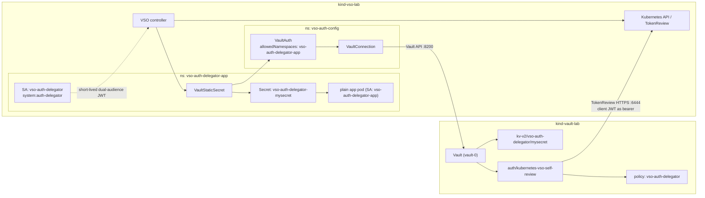
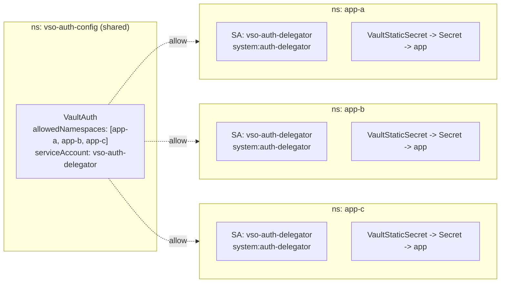

# Vault Secrets Operator: Client JWT Self-Review Kubernetes Auth Demo

This scenario is a **second, parallel** Vault Secrets Operator (VSO)
demonstration. It coexists with -- and never modifies -- the
[default JWT/OIDC scenario](./vso-jwt-oidc-demo.md) (`make vso-deck`), which
remains the default VSO authentication method in this repository.

Both scenarios run across the same two Podman-backed kind clusters:

- `kind-vault-lab` (`VAULT_CONTEXT`) runs Vault only.
- `kind-vso-lab` (`VSO_CONTEXT`) runs VSO, its CRDs, and both demo apps.

See [docs/vso-kubernetes-auth-delegator-plan.md](./vso-kubernetes-auth-delegator-plan.md)
for the full design and acceptance criteria this implementation follows.

## What this scenario demonstrates

Kubernetes auth's **client JWT self-review** mode: the same short-lived
ServiceAccount JWT that VSO submits as its Vault login credential is *also*
the HTTP bearer Vault uses when it independently asks the VSO cluster's own
Kubernetes API to validate that JWT (`POST tokenreviews.authentication.k8s.io`).
The ServiceAccount is authorized to make that TokenReview call about itself
through a scenario-owned `system:auth-delegator` ClusterRoleBinding.

This is different from three other designs already present in this
repository or its history:

| Design | TokenReview HTTP bearer | Where |
| --- | --- | --- |
| Vault-local review | Vault pod's own mounted ServiceAccount JWT | Historical `auth-test` runtime demo (not this repository's default path) |
| Dedicated reviewer | A separate reviewer JWT stored in Vault | Opt-in `scripts/configure-vso-kubernetes-auth.sh`, not run by `make setup` |
| JWT/OIDC discovery | No TokenReview at all -- Vault verifies signatures locally via JWKS | **Default scenario**: `auth/jwt-vso`, `make vso-deck` |
| **Client JWT self-review (this scenario)** | The client's own login JWT | `auth/kubernetes-vso-self-review`, `make auth-delegator-deck` |

## Architecture



## Why client JWT self-review

HashiCorp's Kubernetes auth documentation defines this mode as: omit
`token_reviewer_jwt`, set `disable_local_ca_jwt=true` when Vault itself runs
in Kubernetes, and grant every authenticating client ServiceAccount
`system:auth-delegator` (or an equivalent, narrower TokenReview-only
ClusterRole). Vault then uses the client's own login JWT as its bearer
token when calling the Kubernetes TokenReview API, instead of storing a
dedicated reviewer credential or discovering JWKS out-of-band.

Kubernetes `TokenReview` independently validates signature, issuer, object
binding, expiry, and revocation; the Vault role separately constrains
audience, ServiceAccount, and namespace. `disable_iss_validation=true` is
this plugin's documented default for this mode -- Kubernetes TokenReview
performs issuer validation, so this is not a second, deprecated Vault-side
issuer check.

- <https://developer.hashicorp.com/vault/docs/auth/kubernetes>
- <https://developer.hashicorp.com/vault/docs/deploy/kubernetes/vso/sources/vault/auth>
- <https://developer.hashicorp.com/vault/docs/deploy/kubernetes/vso/api-reference>

## Why the token needs two audiences

The VSO cluster's kube-apiserver is configured with
`--service-account-issuer=https://host.containers.internal:6444` but not
`--api-audiences`, so Kubernetes defaults the accepted API bearer audience to
that issuer URL. A token containing only audience `vault` can satisfy the
Vault role but cannot authenticate as the outer HTTP bearer to this API
server; a token containing only the issuer URL authenticates to the API
server but does not carry the `vault` audience the Vault role's TokenReview
request asks for.

VSO's `VaultAuth` therefore requests one 600-second token with **both**
audiences:

```text
vault
https://host.containers.internal:6444
```

This avoids changing the VSO kube-apiserver's creation-time arguments, so it
never requires deleting or recreating `kind-vso-lab`.

## Resource names (defaults)

All names are dedicated to this scenario; none collide with the default
JWT/OIDC scenario's namespace, mount, Secret, or pod names
(`validate_auth_delegator_env` in `scripts/lib/two-cluster-env.sh` enforces
this). Override any of them with the matching `AUTH_DELEGATOR_*` environment
variable.

| Purpose | Default |
| --- | --- |
| Auth/config namespace | `vso-auth-config` |
| Consumer/app namespace | `vso-auth-delegator-app` |
| Self-review ServiceAccount | `vso-auth-delegator` (in the app namespace only) |
| App ServiceAccount | `vso-auth-delegator-app` (in the app namespace) |
| ClusterRoleBinding | `vso-auth-delegator-self-review` -> `system:auth-delegator` |
| Vault auth mount | `kubernetes-vso-self-review` |
| Vault role / policy | `vso-auth-delegator` |
| Vault KV path | `kv-v2/vso-auth-delegator/mysecret` |
| `VaultConnection` / `VaultAuth` | `vso-auth-delegator` (in the auth namespace) |
| `VaultStaticSecret` / destination Secret | `vso-auth-delegator-mysecret` (in the app namespace) |
| App pod | `vso-auth-delegator-app` (in the app namespace) |
| Vault audience | `vault` |
| API bearer audience | `${VSO_OIDC_ISSUER}` (default `https://host.containers.internal:6444`) |
| ServiceAccount JWT TTL | `600` seconds (VSO's Kubernetes credential provider minimum) |
| Vault token TTL | `1h`, non-renewable batch token |

## RBAC and risk trade-offs

- The scenario-owned ClusterRoleBinding (`vso-auth-delegator-self-review`)
  has **exactly one** subject: the dedicated self-review ServiceAccount. The
  app ServiceAccount, `default`, the VSO controller identity, and the Vault
  server ServiceAccount are all proven unable to create TokenReviews.
- `system:auth-delegator` also grants SubjectAccessReview permissions -- it
  is broader than a custom TokenReview-only ClusterRole. A production
  deployment should prefer a narrower custom ClusterRole; this demo
  deliberately uses `system:auth-delegator` to show the documented standard
  pattern.
- A compromised self-review JWT has both Vault-login capability and
  TokenReview authorization until its 600-second expiry.
- Every Vault login depends on live VSO kube-apiserver availability and
  TokenReview latency, unlike the JWT/OIDC scenario's local signature
  verification.
- The current lab's VSO-to-Vault API path is HTTP. This is acceptable only
  for the disposable local lab; production must use TLS.
- `automountServiceAccountToken: false` is set on both the self-review
  ServiceAccount and the app ServiceAccount; VSO still mints the bounded
  token via `TokenRequest`.
- JWTs, Vault tokens, CA PEM data, and secret values are never placed in
  process arguments, logs, or deck/test output. Kubernetes-auth config and
  KV writes go over stdin as JSON; login JWTs are sent with `jwt=-`.

## Cross-namespace semantics

`VaultConnection` and `VaultAuth` are defined once, centrally, in the auth
namespace (`vso-auth-config`). The `VaultAuth`'s `allowedNamespaces`
contains only the consumer namespace (`vso-auth-delegator-app`).
`VaultStaticSecret` lives in the consumer namespace and references the
`VaultAuth` cross-namespace as `vso-auth-config/vso-auth-delegator`
(`namespace/name`).

The Kubernetes ServiceAccount used for login is resolved from the
**consuming** resource's namespace (the app namespace), even though the
`VaultAuth` itself is centrally defined elsewhere -- this is VSO's documented
cross-namespace behavior, proven live by the verifier (`make
auth-delegator-verify`), which also proves a third, non-allow-listed
namespace is denied by `allowedNamespaces` with no Secret created.

## Scaling to multiple consumer namespaces

This demo ships with **one** consumer namespace
(`vso-auth-delegator-app`). To serve secrets to additional namespaces, you
must widen **all three** of the gates that currently pin to that single
namespace -- and there is one non-obvious requirement: VSO resolves the
login ServiceAccount from the **consuming** resource's namespace, so each
new namespace needs its own privileged self-review ServiceAccount.

### The three single-namespace gates

| Gate | Where | Current value |
| --- | --- | --- |
| VSO allow-list | `VaultAuth.spec.allowedNamespaces` | `[ vso-auth-delegator-app ]` |
| Kubernetes RBAC | `ClusterRoleBinding` `subjects[]` | `vso-auth-delegator-app / vso-auth-delegator` (one subject) |
| Vault role binding | role `bound_service_account_namespaces` | `vso-auth-delegator-app` |

The central `VaultConnection` and `VaultAuth` stay shared. The
`VaultAuth.spec.kubernetes.serviceAccount` field holds a **name**
(`vso-auth-delegator`), not a `namespace/name` -- VSO looks for that
ServiceAccount *in whichever namespace the consuming* `VaultStaticSecret`
*lives*. So each consumer namespace must contain an identically named
self-review ServiceAccount.

### Topology for N namespaces



Each namespace's flow runs the full end-to-end sequence independently
(steps [1]-[8] from the deck), each with its own self-review
ServiceAccount, its own 600s dual-audience token, its own batch Vault
token, and its own destination Secret.

### Per-namespace checklist

For each additional consumer namespace, apply these changes together:

1. **VSO allow-list** -- add the namespace to
   `VaultAuth.spec.allowedNamespaces`.
2. **Self-review ServiceAccount** -- create `vso-auth-delegator` *in the
   new namespace* with `automountServiceAccountToken: false` (VSO still
   mints the bounded 600s token via `TokenRequest`).
3. **Kubernetes RBAC** -- grant `system:auth-delegator` to that
   ServiceAccount. Prefer **one ClusterRoleBinding per namespace** (each
   with exactly one subject) to preserve this scenario's one-subject-per-
   binding invariant and keep removals clean; avoid one giant shared
   ClusterRoleBinding whose subject list must be hand-edited.
4. **Vault role** -- add the namespace to
   `bound_service_account_namespaces` as an explicit list (for example
   `[vso-auth-delegator-app, app-a, app-b]`). **Never use `*`** --
   wildcard namespace access is explicitly out of scope for this scenario
   and removes Vault's namespace boundary.
5. **Consumer resources** -- add the namespace's `VaultStaticSecret`
   referencing the shared `VaultAuth` as
   `vso-auth-config/vso-auth-delegator`, plus its destination Secret and
   the app pod (running under a separate **unprivileged** app
   ServiceAccount, as in this demo).

The dual-audience token, the mount with no stored reviewer, and the
least-privilege policy are unchanged.

### Security trade-off: "exactly one" becomes "one per namespace"

This scenario's core RBAC claim is *"exactly one identity can review
tokens."* With N consumer namespaces you **deliberately widen** that to *N*
privileged identities. It stays tight -- one self-review ServiceAccount per
namespace, never the app ServiceAccount, never `default` -- but it is no
longer a single global reviewer. Each consumer namespace is now an
independent TokenReview-granting surface, so treat each allow-listed
namespace as equally trusted.

### When to switch to the dedicated-reviewer model instead

Client self-review scales well to a **handful of trusted** namespaces. For
**many** namespaces, or any untrusted / multi-tenant workload, it becomes
heavy: N privileged ServiceAccounts to manage and N TokenReview grants to
audit. The better fit is the **dedicated reviewer** model (the second row
of the comparison table above): one reviewer ServiceAccount JWT stored in
Vault via `token_reviewer_jwt`, used for every namespace's TokenReview. The
trade-off flips -- instead of N short-lived privileged client
ServiceAccounts, you have a single stored credential in Vault to rotate
carefully, and clients need **zero** `system:auth-delegator`. See
`scripts/configure-vso-kubernetes-auth.sh` for the existing opt-in
dedicated-reviewer path.

## Setup

`make auth-delegator-setup` configures only the dedicated auth mount and
applies only this scenario's resources. It never touches
`auth/kubernetes`, `auth/jwt-vso`, the historical `auth/kubernetes-vso`
mount, or the `vso-demo` namespace.

```sh
make configure-auth-delegator   # auth/kubernetes-vso-self-review mount, role, policy
make auth-delegator-apply       # namespaces, ServiceAccounts, CRB, CRDs, app pod
# or both in one step:
make auth-delegator-setup
```

Both underlying scripts support a non-mutating `--check-only` mode:

```sh
scripts/configure-vso-auth-delegator.sh --check-only
scripts/apply-vso-auth-delegator-demo.sh --check-only
```

Neither this setup path, the verifier, nor the deck ever creates, deletes,
or recreates a kind cluster, and neither ever runs Helm install/upgrade.
Both existing kind control-plane containers, Vault, and VSO must already
exist (`make setup` / `make clusters` / `make setup-vault` / `make
setup-vso`).

## Verification

```sh
make auth-delegator-verify              # full run, including CAS rotation
scripts/verify-vso-auth-delegator.sh --skip-rotation   # faster health check
scripts/verify-vso-auth-delegator.sh --check-only      # no writes at all
make auth-delegator-status              # show resources across both clusters
```

The full verifier proves, in order (failing fast, each section reported
separately):

1. Contexts, compatibility, and a baseline snapshot of the coexisting
   default JWT/OIDC scenario (so section 10 can prove no regression).
2. Placement and ownership of every scenario resource.
3. Network/TLS reachability in both directions.
4. RBAC and reviewer selection: exactly one CRB subject; only the
   self-review ServiceAccount can create TokenReviews; the live Vault mount
   has `disable_local_ca_jwt=true`, `disable_iss_validation=true`, and no
   stored reviewer JWT.
5. JWT claims (issuer, subject, both audiences, bounded lifetime) and a
   **direct** TokenReview proof: the same in-memory token used as both the
   outer HTTP bearer and `spec.token`, with `spec.audiences=["vault"]`.
6. Vault login (positive) and every audience/identity negative case
   (vault-audience-only, API-audience-only, wrong ServiceAccount).
7. Vault token constraints: non-renewable batch token, exactly the
   dedicated policy, no identity policies, bounded TTL.
8. Cross-namespace sync and deny-by-default: `VaultAuth` valid in the auth
   namespace; `VaultStaticSecret`/Secret/app Ready in the consumer
   namespace; a temporary third-namespace `VaultStaticSecret` is denied
   with no Secret created (a scoped trap removes only that temporary
   object).
9. Full-object CAS rotation: capture the complete pre-test KV object and
   version, mutate with `cas=<original-version>`, observe the consumer
   Secret change, then restore with `cas=<mutated-version>` on success,
   error, `HUP`, `INT`, or `TERM` -- refusing to clobber a concurrent
   writer. Skipped by `--skip-rotation`.
10. No regression: the default JWT/OIDC mount/role and `vso-demo` CR specs
    are byte-for-byte unchanged.

## The Presenterm deck

```sh
make auth-delegator-deck
```

This target is health-first and never falls back to cluster creation:

1. Requires Presenterm.
2. Starts Podman and restarts/reuses only the **existing** kind
   control-plane containers via
   `scripts/prepare-vso-deck-env.sh --require-existing`, which fails
   immediately (no cluster creation, no `make setup` suggestion) if either
   container is absent.
3. Verifies the existing JWT/OIDC scenario with `--skip-rotation`.
4. Health-checks this scenario with `--skip-rotation`. If unhealthy, runs
   `make auth-delegator-setup` once and continues.
5. Runs the full verifier, including reversible CAS rotation.
6. Re-verifies the JWT/OIDC scenario with `--skip-rotation` to prove no
   regression.
7. Only then launches `presenterm -x presenterm/auth-delegator.md`.

The deck itself (`presenterm/auth-delegator.md`) is a 12-slide read-only
auth walkthrough: every `+exec` block uses an explicit `--context`, no raw
JWT/Vault-token/secret/CA material is ever printed, and no slide mutates
Vault or Kubernetes. The flow is: k8s RBAC (one `system:auth-delegator`
subject) → token claims decode → direct TokenReview self-review proof →
Vault mount config (no stored reviewer, no local pod JWT) → least-privilege
role and policy → positive login proof → negative proofs (wrong audience,
wrong ServiceAccount — one slide each) → cross-namespace `VaultAuth`
consumption → app consumption of the synced Secret.

Visual/structural validation of the deck uses the repository-owned
`scripts/validate-deck-visual.sh` (private tmux socket, optional Kitty
wrapper, scoped cleanup -- see that script's header for details). It never
sends `Ctrl+E`, so it never executes a `+exec` block or mutates a live
cluster.

## Troubleshooting

**`auth/kubernetes-vso-self-review` config check fails (`disable_local_ca_jwt`,
`disable_iss_validation`, or `token_reviewer_jwt_set`):** re-run
`make configure-auth-delegator`; it is idempotent and refuses to overwrite a
same-name foreign mount (wrong type or ownership description).

**TokenReview / Vault login negative cases behave unexpectedly:** confirm
the VSO cluster's kube-apiserver still advertises
`https://host.containers.internal:6444` as its issuer
(`kubectl --context kind-vso-lab get --raw='/.well-known/openid-configuration' | jq .issuer`)
and that `AUTH_DELEGATOR_API_AUDIENCE` still equals `VSO_OIDC_ISSUER` --
`validate_auth_delegator_env` fails fast if these diverge.

**RBAC gate fails (`system:auth-delegator` proof):** confirm the
ClusterRoleBinding has exactly the self-review ServiceAccount as its sole
subject: `kubectl --context kind-vso-lab get clusterrolebinding
vso-auth-delegator-self-review -o yaml`. Other, unrelated
`system:auth-delegator` bindings (e.g. from the Helm chart or the legacy
dedicated-reviewer path) are reported by the verifier but never modified.

**Rotation section reports a concurrent-writer conflict:** another writer
advanced the KV version after this scenario's mutation. The verifier
refuses to clobber it and prints the original data plus manual recovery
instructions; compare and restore by hand with
`vault kv put -mount=kv-v2 -cas=<current-version> vso-auth-delegator/mysecret ...`
only after confirming the concurrent write was not itself an in-progress
verifier run.

**`make auth-delegator-deck` fails at the `--require-existing` step:**
this is by design -- the target never creates or recreates a cluster. Run
`make clusters` (or `make setup`) first, then re-run
`make auth-delegator-deck`.

## Comparison with the default JWT/OIDC scenario

| Aspect | JWT/OIDC (default) | Client JWT self-review (this scenario) |
| --- | --- | --- |
| TokenReview | Never called | Called once per login, using the client's own JWT |
| Reviewer credential | None (JWKS discovery) | None (`token_reviewer_jwt` explicitly empty) |
| RBAC | None beyond the JWKS-reader ClusterRole | `system:auth-delegator` on one dedicated ServiceAccount |
| Auth mount | `auth/jwt-vso` | `auth/kubernetes-vso-self-review` |
| Namespaces | Single `vso-demo` namespace | Auth namespace (`vso-auth-config`) and consumer namespace (`vso-auth-delegator-app`) differ |
| `VaultAuth` reference | Same namespace as `VaultStaticSecret` | Cross-namespace `namespace/name` reference via `allowedNamespaces` |

Both scenarios are proven, in the same verifier run, to leave each other
byte-for-byte unchanged.

## Manual cleanup (explicit confirmation required)

No target in this repository automatically removes this scenario's
resources, and none deletes or recreates either kind cluster. To remove
this scenario only, run these commands **after confirming with the user**:

```sh
kubectl --context kind-vso-lab delete namespace vso-auth-config vso-auth-delegator-app
kubectl --context kind-vso-lab delete clusterrolebinding vso-auth-delegator-self-review
kubectl --context kind-vault-lab exec vault-0 -n default -- vault auth disable kubernetes-vso-self-review
kubectl --context kind-vault-lab exec vault-0 -n default -- vault policy delete vso-auth-delegator
kubectl --context kind-vault-lab exec vault-0 -n default -- vault kv metadata delete -mount=kv-v2 vso-auth-delegator/mysecret
```

These commands do not affect the default JWT/OIDC scenario's `auth/jwt-vso`
mount, `vso-demo` namespace, or any other resource in either cluster.

## Related documentation

- [Implementation plan](./vso-kubernetes-auth-delegator-plan.md)
- [Default JWT/OIDC scenario](./vso-jwt-oidc-demo.md)
- [Podman migration and networking](../PODMAN_MIGRATION.md)
- [Auth-delegator Presenterm deck](../presenterm/auth-delegator.md)
- [Default VSO Presenterm deck](../presenterm/vso.md)
- [Repository overview](../README.md)
