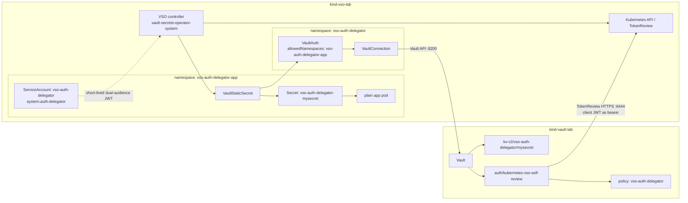
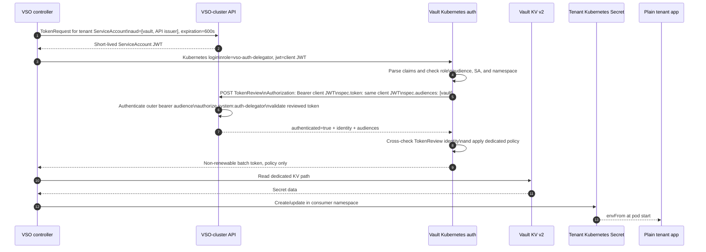

# Plan: VSO cross-cluster Kubernetes auth with client JWT self-review

**Status:** Revised after independent architecture/security review; implementation-ready
**Target branch:** `main`
**Primary entry point:** `make auth-delegator-deck`
**Existing scenario preserved:** `make vso-deck` using JWT/OIDC discovery

## 1. Objective

Add a second, parallel Vault Secrets Operator demonstration in which:

1. Vault runs in `kind-vault-lab`.
2. VSO runs in the separate `kind-vso-lab` cluster.
3. VSO requests a short-lived Kubernetes ServiceAccount token from
   `kind-vso-lab`.
4. The same token is:
   - the `jwt` submitted to Vault's Kubernetes auth login endpoint; and
   - the HTTP bearer credential Vault uses when it calls the
     `kind-vso-lab` TokenReview API.
5. The ServiceAccount represented by that token has
   `system:auth-delegator`, allowing it to authorize its own TokenReview call.
6. Vault issues a narrowly scoped, non-renewable token that VSO uses to read a
   dedicated KV secret.
7. A centrally defined `VaultAuth` in one namespace is consumed by a
   `VaultStaticSecret` in another namespace, and VSO materializes the native
   Kubernetes Secret in that consumer namespace.
8. A separate Presenterm deck proves the complete flow through
   `make auth-delegator-deck`.

The result must coexist with, rather than replace, the existing JWT/OIDC demo.

## 2. Terminology

This plan calls the requested Kubernetes auth mode **client JWT self-review**.
It is important to distinguish three TokenReview designs:

| Design | Token used as TokenReview HTTP bearer | Implemented where |
| --- | --- | --- |
| Vault-local reviewer | Vault pod's mounted ServiceAccount JWT | Historical `auth-test` runtime demo |
| Dedicated reviewer | A separate reviewer JWT stored in Vault | Existing opt-in `scripts/configure-vso-kubernetes-auth.sh` |
| Client JWT self-review | The same short-lived JWT submitted to Vault login | New scenario in this plan |

The new scenario is the third design. It must not be described as the behavior
already implemented by `auth-test`.

## 3. Findings from `auth-test`

The `auth-test` worktree is useful for understanding TokenReview and
`system:auth-delegator`, but its committed runtime path does not implement the
requested design.

Its `create_vault.sh` writes only `kubernetes_host` to
`auth/kubernetes/config`. Because it does not set `disable_local_ca_jwt=true`,
Vault loads the Vault pod's local ServiceAccount token and CA. The client JWT is
the token under review, while the Vault pod JWT is the HTTP bearer used for the
TokenReview request.

The extra `system:auth-delegator` binding on `default/default` is therefore
redundant in that historical flow. The chart-created binding on the Vault
server ServiceAccount normally supplies the real reviewer permission.

The reusable lessons are:

- TokenReview authenticates the presented Kubernetes identity; it does not
  grant Vault secret access.
- Kubernetes RBAC authorizes whichever identity supplies the HTTP bearer for
  `POST tokenreviews.authentication.k8s.io`.
- `system:auth-delegator` grants TokenReview and SubjectAccessReview
  capabilities and is broader than a TokenReview-only custom ClusterRole.
- Vault roles and policies still provide the final namespace, ServiceAccount,
  audience, and secret-path authorization boundaries.
- Reviewer selection must be proven from Vault configuration, not inferred
  merely from the existence of a ClusterRoleBinding.

## 4. Authoritative behavior used by the design

HashiCorp's Kubernetes auth documentation defines client JWT self-review as:

- omit `token_reviewer_jwt`;
- set `disable_local_ca_jwt=true` when Vault itself runs in Kubernetes; and
- grant every authenticating client ServiceAccount `system:auth-delegator` or
  equivalent TokenReview permission.

Vault then uses the client's login JWT as its bearer token when calling the
Kubernetes TokenReview API. The Kubernetes auth plugin defaults to
`disable_iss_validation=true`; this plan retains and verifies that setting
instead of claiming a second, deprecated Vault-side issuer check. Kubernetes
TokenReview validates signature, issuer, object binding, expiry, and revocation,
while the Vault role separately constrains audience, ServiceAccount, and
namespace.

VSO supports the required Kubernetes credential-provider fields:

- `serviceAccount`;
- `audiences`; and
- `tokenExpirationSeconds`, with a minimum of 600 seconds.

VSO also supports a `VaultStaticSecret` referring to a `VaultAuth` in another
namespace using `namespace/name`. The referenced `VaultAuth` must explicitly
allow the consumer namespace. For Kubernetes auth, the ServiceAccount is
resolved from the consuming secret resource's namespace.

References:

- <https://developer.hashicorp.com/vault/docs/auth/kubernetes>
- <https://developer.hashicorp.com/vault/docs/deploy/kubernetes/vso/sources/vault/auth>
- <https://developer.hashicorp.com/vault/docs/deploy/kubernetes/vso/api-reference>
- <https://kubernetes.io/docs/reference/command-line-tools-reference/kube-apiserver/>

## 5. Audience decision: dual-audience short-lived token

The current VSO kube-apiserver has:

```text
--service-account-issuer=https://host.containers.internal:6444
```

It does not set `--api-audiences`, so Kubernetes defaults the accepted API
bearer audience to the issuer URL. A token containing only audience `vault`
can satisfy a Vault role but cannot authenticate as the HTTP bearer to this API
server.

The new VSO `VaultAuth` will therefore request a 600-second token with both:

```text
vault
https://host.containers.internal:6444
```

The two audiences serve different checks:

- `vault` is configured on the Vault Kubernetes role. The plugin passes this as
  `TokenReview.spec.audiences=["vault"]` and also enforces the role constraint.
- the issuer URL lets the same JWT authenticate as the **outer HTTP bearer** to
  the VSO kube-apiserver before Kubernetes evaluates the TokenReview body.

A direct verifier request will use one in-memory token for both
`Authorization: Bearer <JWT>` and `spec.token`, with
`spec.audiences=["vault"]`, proving both audience layers independently of the
Vault login proof.

This avoids changing creation-time kube-apiserver arguments and therefore
avoids deleting or recreating `kind-vso-lab`. Validation must fail with an
actionable message if the live cluster's issuer or accepted API audience is
incompatible.

## 6. Scenario isolation and naming

All new resources use dedicated names so the two VSO scenarios can run
simultaneously.

Proposed defaults:

| Purpose | Default |
| --- | --- |
| Auth/config namespace | `vso-auth-delegator` |
| Consumer/app namespace | `vso-auth-delegator-app` |
| Self-review ServiceAccount | `vso-auth-delegator` in the consumer namespace |
| App ServiceAccount | `vso-auth-delegator-app` in the consumer namespace |
| ClusterRoleBinding | `vso-auth-delegator-self-review` |
| Vault auth mount | `kubernetes-vso-self-review` |
| Vault role | `vso-auth-delegator` |
| Vault policy | `vso-auth-delegator` |
| Vault KV path | `kv-v2/vso-auth-delegator/mysecret` |
| `VaultConnection` | `vso-auth-delegator` in the auth namespace |
| `VaultAuth` | `vso-auth-delegator` in the auth namespace |
| `VaultStaticSecret` | `vso-auth-delegator-mysecret` in the app namespace |
| Destination Secret | `vso-auth-delegator-mysecret` in the app namespace |
| App pod | `vso-auth-delegator-app` in the app namespace |
| Vault audience | `vault` |
| API bearer audience | `${VSO_OIDC_ISSUER}` |
| ServiceAccount JWT TTL | `600` seconds |
| Vault token TTL | `1h` |

The existing resources remain unchanged:

- `auth/jwt-vso`;
- namespace `vso-demo`;
- `VaultAuth/vso-demo-auth`;
- `VaultStaticSecret/vso-demo-mysecret`; and
- `presenterm/vso.md`.

## 7. Target architecture



## 8. Runtime sequence



## 9. Security model

### Required safeguards

- The scenario-owned ClusterRoleBinding must contain exactly one subject: the
  dedicated self-review ServiceAccount.
- Do not add a binding for the app ServiceAccount, `default`, the VSO
  controller, or the Vault server ServiceAccount. Pre-existing bindings owned
  by the Helm chart or the historical dedicated-reviewer path are reported but
  not removed or treated as scenario-owned.
- Label and annotate every scenario-owned Kubernetes resource. Refuse to take
  over a same-name object lacking the expected ownership marker.
- Before reusing a same-name Vault mount, require type `kubernetes` and the
  expected scenario description; otherwise stop rather than overwrite it.
- A same-name Vault policy is reusable only when its canonical rules exactly
  equal the scenario's expected policy; otherwise refuse to overwrite it.
- Mark the KV-v2 path with custom metadata identifying this scenario. Reuse or
  mutate it only when that marker matches; an unmarked or foreign path causes a
  fail-safe stop.
- Set `automountServiceAccountToken: false` on both the privileged self-review
  ServiceAccount and the plain app pod. VSO can still use TokenRequest to mint
  the bounded token.
- Never place the privileged self-review ServiceAccount on the app pod.
- Use an exact Vault role binding for:
  - ServiceAccount name;
  - consumer namespace; and
  - Vault audience.
- Suppress Vault's default policy.
- Issue a non-renewable batch token with only the dedicated read policy.
- Keep JWTs, Vault tokens, CA PEM data, unseal keys, and secret values out of
  process arguments, logs, deck output, and test fixtures.
- Send Kubernetes-auth config and KV write payloads as JSON over stdin so CA PEM
  and secret data never appear in argv. Sanitize structured readback with
  `jq del(...)` before printing.
- Pass login JWTs through stdin using `jwt=-`.
- Verify `token_reviewer_jwt_set=false` and `disable_local_ca_jwt=true` from the
  live Vault mount configuration.

### Explicit demo trade-offs

- `system:auth-delegator` also grants SubjectAccessReview permissions. A custom
  TokenReview-only ClusterRole is narrower and should be recommended for
  production, but the demo deliberately uses `system:auth-delegator` to show
  the requested standard pattern.
- A compromised self-review JWT has both Vault-login capability and
  TokenReview authorization until its 600-second expiry.
- Every Vault login depends on live VSO kube-apiserver availability and
  TokenReview latency.
- The current lab's VSO-to-Vault API path is HTTP. This is acceptable only for
  the disposable local lab; production must use TLS.

## 10. Implementation plan

### Phase 1: shared configuration

Modify `scripts/lib/two-cluster-env.sh` to add `AUTH_DELEGATOR_*` defaults for:

- both namespaces;
- ServiceAccounts;
- ClusterRoleBinding;
- Vault mount, role, policy, KV path, and token TTL;
- VSO resource names;
- Vault and API audiences; and
- ServiceAccount token expiration.

Add `validate_auth_delegator_env` to require:

- distinct auth and consumer namespaces;
- 600 seconds or greater token expiration;
- non-empty, distinct audiences;
- API audience equal to the externally configured VSO issuer;
- dedicated names that do not collide with the JWT/OIDC scenario; and
- a self-consistent external VSO API address.

Add a reusable runtime preflight that feature-detects rather than assumes:

- the deployed VSO version and image;
- CRD schema support for `allowedNamespaces`, Kubernetes `audiences`,
  `tokenExpirationSeconds`, and cross-namespace `vaultAuthRef`;
- operator RBAC to create `serviceaccounts/token` in the consumer namespace;
- required Vault Kubernetes-auth config/role response fields; and
- both existing kind control-plane containers.

Expose the environment values through `print_two_cluster_env` without printing
secrets.

### Phase 2: configure Vault Kubernetes auth

Add `scripts/configure-vso-auth-delegator.sh` with strict mode,
`--check-only`, shared preflight helpers, and explicit context wrappers.

`--check-only` performs no writes. It validates contexts, existing control-plane
containers, live Vault/VSO versions and fields, endpoints, CA data, audiences,
mount-name availability, and prerequisites.

The mutating mode will:

1. Require existing, different contexts and a ready, unsealed Vault.
2. Read the VSO cluster CA from kubeconfig without printing it.
3. Enable only `auth/kubernetes-vso-self-review`, idempotently. If the mount
   already exists, require type `kubernetes` and the expected ownership
   description before changing it.
4. Send the auth configuration as JSON over stdin:

   ```text
   kubernetes_host=${VSO_API_ADDR}
   kubernetes_ca_cert=<VSO cluster CA>
   disable_local_ca_jwt=true
   disable_iss_validation=true
   token_reviewer_jwt=""
   ```

   The empty reviewer field clears drift. Issuer validation deliberately stays
   with Kubernetes TokenReview; the deprecated duplicate Vault issuer check is
   not enabled.
5. Read back JSON and fail unless:
   - the host matches;
   - local JWT loading is disabled;
   - issuer validation is disabled as designed; and
   - `token_reviewer_jwt_set=false`.
6. Create the sole scenario-owned Vault policy, granting only `read` on the
   dedicated KV v2 data path.
7. Create a role bound exactly to the self-review ServiceAccount, consumer
   namespace, and `vault` audience.
8. Configure no default policy, `token_type=batch`, and a one-hour TTL.
9. Print only sanitized configuration and pass/fail statements.

It must never alter `auth/kubernetes`, `auth/jwt-vso`, or the historical
`auth/kubernetes-vso` dedicated-reviewer mount. It must snapshot the existing
JWT/OIDC mount/role configuration so the verifier can compare it after setup.

### Phase 3: apply cross-namespace VSO resources

Add `scripts/apply-vso-auth-delegator-demo.sh` with a non-mutating
`--check-only` mode. Check-only runs the shared version/CRD/RBAC/network
preflight, renders and validates manifests, and performs no Vault or Kubernetes
writes.

The mutating mode will:

1. Require existing Vault and VSO installations; it will not create clusters or
   install/upgrade Helm releases.
2. Feature-detect the required VSO 1.4-compatible CRD fields and TokenRequest
   RBAC before applying anything.
3. Create both dedicated namespaces idempotently with ownership labels and
   annotations; fail rather than adopt same-name foreign resources.
4. Seed the dedicated KV fixture only when absent, using a JSON stdin payload,
   then attach scenario ownership through KV-v2 custom metadata. If the path
   already exists, require the exact ownership marker before reading or
   mutating it. The configure script is the sole owner of policy creation and
   accepts an existing policy only when its canonical content exactly matches.
5. Create the self-review ServiceAccount **only** in the consumer namespace,
   with token automount disabled.
6. Create one owned ClusterRoleBinding whose sole subject is that exact
   ServiceAccount and whose role is `system:auth-delegator`.
7. Create a separate unprivileged app ServiceAccount.
8. Create `VaultConnection` and `VaultAuth` in the auth namespace.
9. Configure the `VaultAuth` with:
   - `method: kubernetes`;
   - the dedicated mount and role;
   - the self-review ServiceAccount name;
   - both audiences;
   - `tokenExpirationSeconds: 600`; and
   - `allowedNamespaces` containing only the consumer namespace.
10. Create `VaultStaticSecret` in the consumer namespace with a
    `vaultAuthRef` of `vso-auth-delegator/vso-auth-delegator`.
11. Materialize the destination Secret in the consumer namespace.
12. Run a plain, single-container app under the unprivileged app
    ServiceAccount, consuming the native Secret through `envFrom`.
13. Wait for `VaultAuth` status, `VaultStaticSecret` Ready, destination Secret,
    and pod readiness without exposing the value.

This proves that centralized VSO auth configuration in one namespace can be
used to materialize and consume a Secret in another allowed namespace, and that
Kubernetes credentials are resolved from the consuming resource's namespace.

### Phase 4: end-to-end verifier

Add `scripts/verify-vso-auth-delegator.sh` with `--check-only` and
`--skip-rotation`.

`--check-only` performs no writes and validates existing containers, contexts,
versions, CRD fields, RBAC capabilities, endpoints, CA trust, audience
coherence, and required commands.

The full verifier will fail fast through these gates:

1. **Contexts, compatibility, and baseline snapshot**
   - contexts exist and differ;
   - both existing control-plane containers are present;
   - environment/audiences are coherent;
   - required VSO CRD fields and operator TokenRequest RBAC exist;
   - existing JWT/OIDC mount, role, and `vso-demo` CR specs are snapshotted.
2. **Placement and ownership**
   - Vault exists only in `kind-vault-lab`;
   - VSO exists only in `kind-vso-lab`;
   - auth and consumer resources are in their dedicated namespaces;
   - every scenario resource has the expected ownership marker;
   - the self-review ServiceAccount exists only in the consumer namespace.
3. **Network and TLS**
   - VSO can reach Vault;
   - Vault can reach the external VSO API using the VSO cluster CA.
4. **RBAC and reviewer selection**
   - the scenario ClusterRoleBinding has exactly one expected subject;
   - the self-review ServiceAccount can create TokenReviews;
   - the app, default, and controller ServiceAccounts cannot;
   - allowed legacy/chart delegator bindings are reported but not modified;
   - Vault has `disable_local_ca_jwt=true`,
     `disable_iss_validation=true`, and `token_reviewer_jwt_set=false`.
5. **JWT claims and direct self-review proof**
   - mint one 600-second dual-audience token in memory;
   - decode and assert issuer, subject, both audiences, and bounded lifetime
     without printing the token;
   - make a direct TokenReview request using that same variable as both the
     outer HTTP bearer and `spec.token`, with `spec.audiences=["vault"]`;
   - assert HTTP success, `authenticated=true`, the exact identity, and returned
     `vault` audience.
6. **Vault login and negative authentication**
   - send the same dual-audience JWT to Vault through stdin and prove login;
   - correct SA with only `vault` fails because the outer API bearer audience is
     unacceptable;
   - correct SA with only the API audience fails the Vault role/TokenReview
     requested-audience requirement;
   - wrong SA with both audiences is rejected by one or both independent
     controls; its missing TokenReview RBAC is proven separately with
     `kubectl auth can-i`, not inferred from the login error.
7. **Vault token constraints**
   - `renewable=false` and `token_type=batch`;
   - `token_policies` and effective `policies` contain only the dedicated
     policy;
   - `identity_policies` is empty;
   - TTL is positive and no greater than the configured maximum.
8. **Cross-namespace sync and deny-by-default**
   - `VaultAuth` status is valid in the auth namespace;
   - `VaultStaticSecret`, destination Secret, and app are Ready in the consumer
     namespace;
   - no destination Secret appears in the auth namespace;
   - the app uses the separate unprivileged SA, has no Vault annotations or
     sidecar, and consumes the expected data;
   - a verifier-owned temporary VSS in a third namespace is denied by
     `allowedNamespaces` and creates no Secret; a scoped trap removes only that
     temporary object/namespace.
9. **Rotation and exact restoration**
   - require the expected KV custom-metadata ownership marker;
   - capture the complete pre-test KV v2 data object and original version;
   - mutate with `cas=<original-version>` using JSON over stdin and record the
     resulting mutated version;
   - observe the consumer-namespace Secret change;
   - restore the complete original object only with
     `cas=<mutated-version>` on success, error, HUP, INT, or TERM;
   - if another writer advances the version, refuse to clobber it, report the
     conflict, and leave recovery instructions;
   - reconcile ambiguous write outcomes by reading the current version/content
     before deciding whether restoration is safe;
   - verify both Vault content and synchronized Secret are restored before
     disarming the trap.
10. **No regression**
    - compare the JWT/OIDC mount/role and `vso-demo` CR snapshots byte-for-byte
      after normalized JSON filtering.

The direct TokenReview, positive Vault login, live mount configuration, RBAC
checks, and `vault`-only negative collectively prove that the client JWT is the
TokenReview bearer. Each audience, RBAC, and Vault-policy assertion is reported
separately so one failure is not over-attributed to another control.

### Phase 5: Make targets and health-first deck launcher

Add these Make targets:

```text
configure-auth-delegator
auth-delegator-apply
auth-delegator-setup
auth-delegator-verify
auth-delegator-status
auth-delegator-deck
```

`auth-delegator-setup` will configure only the dedicated auth mount and apply
only the new scenario resources.

`auth-delegator-deck` will:

1. Require Presenterm.
2. Start Podman and restart/reuse only existing kind control-plane containers
   through a new `--require-existing` mode on
   `scripts/prepare-vso-deck-env.sh`. That mode fails immediately if either
   container is absent and never suggests or invokes cluster creation.
3. Run the existing JWT/OIDC verifier with `--skip-rotation`.
4. Verify the existing auth-delegator scenario with `--skip-rotation`.
5. If that verification fails, run `auth-delegator-setup` once and re-verify.
6. Run the full auth-delegator verifier, including reversible rotation.
7. Re-run the existing JWT/OIDC verifier with `--skip-rotation` to prove no
   regression.
8. Launch `presenterm -x presenterm/auth-delegator.md` only after all gates
   pass.

The target and its transitive script/Make call graph must never call cluster
creation, cluster deletion, `make setup`, Helm install/upgrade, or cluster
recreation. Missing or incompatible existing clusters must cause a clear
failure. Any required cluster recreation needs separate explicit user approval.

### Phase 6: Presenterm deck

Add `presenterm/auth-delegator.md`, separate from `presenterm/vso.md`, and add
`scripts/validate-deck-visual.sh` as the repository-owned, reusable visual
validator used by both automated checks and the Kitty/tmux rehearsal.

The deck will explain and prove:

- the difference between Vault-local review, dedicated reviewer, client
  self-review, and OIDC/JWKS;
- two-cluster placement and network paths;
- why a dual-audience token is required in the current cluster;
- the exact `system:auth-delegator` subject;
- short-lived TokenRequest claims without exposing the JWT;
- Vault config with local JWT loading disabled and no stored reviewer;
- positive self-review login;
- wrong-audience and wrong-ServiceAccount failures;
- exact Vault policy and batch-token behavior;
- cross-namespace `VaultAuth` use through `allowedNamespaces` and
  `namespace/name` reference;
- native Secret materialization in the consumer namespace;
- a plain app with no Vault awareness; and
- rotation followed by baseline restoration.

Executable blocks must use explicit contexts, avoid raw credential output, and
fit within the terminal viewport. Every mutating deck operation must complete
mutation, observation, and trap-protected restoration inside one script
invocation or one executable block; no later slide may be required to restore
state. The final reset slide is non-destructive and restores fixture data only.

### Phase 7: documentation

Add `docs/vso-kubernetes-auth-delegator-demo.md` covering:

- architecture and sequence;
- client JWT self-review selection;
- dual audiences;
- RBAC and risk trade-offs;
- cross-namespace semantics;
- setup, verification, and troubleshooting;
- comparison with JWT/OIDC and dedicated-reviewer modes; and
- manual, explicitly authorized cleanup instructions.

Update:

- `README.md` with a fourth scenario and command index entries;
- `PODMAN_MIGRATION.md` with the Vault-to-VSO TokenReview path on port 6444;
- supporting documentation links.

The docs must state that JWT/OIDC remains the default VSO scenario and the new
flow is an explicit alternative.

### Phase 8: static tests

Add:

- `scripts/tests/test-configure-vso-auth-delegator-validation.sh`;
- `scripts/tests/test-apply-vso-auth-delegator-validation.sh`;
- `scripts/tests/test-verify-vso-auth-delegator-validation.sh`;
- `scripts/tests/test-auth-delegator-deck-validation.sh`;
- `scripts/tests/test-auth-delegator-deck-startup-validation.sh`; and
- `scripts/tests/test-auth-delegator-docs-validation.sh`; and
- tests for the new `scripts/validate-deck-visual.sh` harness.

Extend `scripts/tests/test-two-cluster-env-validation.sh` for the new defaults
and validation rules.

Tests must assert:

- exact mount/resource isolation and ownership checks;
- `disable_local_ca_jwt=true`, `disable_iss_validation=true`, and no reviewer;
- explicit VSO API CA and host, written through JSON stdin rather than argv;
- exact role SA/namespace/audience/policy;
- dual audiences, requested TokenReview `vault` audience, and 600-second tokens;
- the scenario binding has exactly the self-review SA, while app/default/controller
  SAs cannot review; legacy bindings are tolerated but never changed;
- privileged token automount is disabled;
- the app uses a different unprivileged ServiceAccount;
- exact cross-namespace reference, allow-list, and third-namespace denial;
- direct same-JWT TokenReview proof, positive login, and all negative gates;
- JWTs and KV values are passed through stdin and never printed;
- full-object CAS rotation uses original/mutated versions, handles HUP and
  ambiguous successful writes, refuses concurrent-writer clobbering, and has
  failure-injection tests plus post-restore verification;
- deck startup's transitive call graph cannot create, delete, or recreate
  clusters, invoke `make setup`, or run Helm install/upgrade; and
- the existing JWT/OIDC setup remains the default and its normalized specs are
  unchanged.

Use command shims to record actual commands, reject writes during every
`--check-only` path, and test ordering/error propagation rather than relying
only on string presence. Render manifests and use server-side dry-run where the
live API is available. Run Bash syntax, ShellCheck, Mermaid rendering,
`git diff --check`, and every repository test suite.

## 11. Live validation plan

After static validation:

1. Confirm both kind control-plane containers already exist.
2. Start/recover them without recreation.
3. Run the existing JWT/OIDC verifier before changes.
4. Run both new scripts with `--check-only`.
5. Run `make auth-delegator-setup` twice to prove idempotence.
6. Run the full new verifier, including negative cases and rotation restore.
7. Run the existing JWT/OIDC verifier again.
8. Extract and inspect every Presenterm executable block, then obtain approval
   before running mutating blocks.
9. Validate with the canonical Presenterm workflow:
   - run `scripts/validate-deck-visual.sh` and footer-based slide walking;
   - launch Presenterm directly as the command of a private `tmux -L` session
     inside `kitty --detach`;
   - capture real Kitty screenshots for every diagram slide and mark them
     visually acceptable only after checking alignment and clipping;
   - execute each approved block individually first;
   - perform a final live `Ctrl+E` rehearsal and capture `[finished]`/error
     evidence;
   - confirm Vault and Kubernetes data are restored; and
   - terminate only PID/socket/deck-scoped Kitty/tmux processes, never broad
     `pkill` patterns.
10. Record evidence in
    `docs/vso-kubernetes-auth-delegator-e2e-validation.md`.

## 12. Rollback and cleanup

All resources are isolated, so failures can be retried without touching the
JWT/OIDC scenario.

No automatic cleanup target will be added. Documentation may provide exact
commands to remove:

- the two dedicated namespaces;
- the dedicated ClusterRoleBinding;
- the dedicated Vault Kubernetes auth mount;
- the dedicated policy; and
- the dedicated KV path.

Executing those commands requires explicit user confirmation. Neither setup,
verification, the deck, nor rollback may delete or recreate either kind
cluster.

## 13. Acceptance criteria

- [ ] Existing `make vso-deck` behavior and JWT/OIDC resources are unchanged.
- [ ] A dedicated Vault Kubernetes auth mount targets `kind-vso-lab`.
- [ ] The mount has `disable_local_ca_jwt=true` and no reviewer JWT.
- [ ] VSO requests a 600-second token with Vault and API-server audiences.
- [ ] The scenario-owned `system:auth-delegator` binding has exactly the
      dedicated self-review ServiceAccount; app/default/controller identities
      cannot create TokenReviews, and unrelated legacy bindings are unchanged.
- [ ] The same JWT is directly proven as TokenReview bearer and reviewed token,
      then used for Vault login; outer bearer and requested audiences are
      verified independently.
- [ ] Correct login succeeds; audience and identity negative cases fail.
- [ ] Vault returns a non-renewable batch token with only the dedicated policy.
- [ ] VSO reads only the dedicated KV path.
- [ ] `VaultAuth` and `VaultStaticSecret` are in different namespaces.
- [ ] The destination Secret and plain app exist in the consumer namespace.
- [ ] The privileged auth ServiceAccount is not mounted into the app.
- [ ] Full-object CAS rotation is observed and exact Vault/Kubernetes state is
      restored on all exits before traps are disarmed.
- [ ] `make auth-delegator-deck` is health-first and opens Presenterm only
      after all gates pass.
- [ ] No target automatically creates, deletes, or recreates a cluster.
- [ ] All static tests, ShellCheck, Mermaid rendering, and diff checks pass.
- [ ] Live validation passes in Kitty/tmux and dedicated processes are stopped.

## 14. Out of scope

- Replacing JWT/OIDC as the default VSO authentication method.
- Deleting the historical dedicated-reviewer compatibility implementation.
- Automatically changing kube-apiserver audiences.
- Automatically deleting or recreating kind clusters.
- Granting `system:auth-delegator` to application workloads generally.
- Production TLS implementation for the Vault API endpoint.
- Multi-tenant wildcard namespace access.
